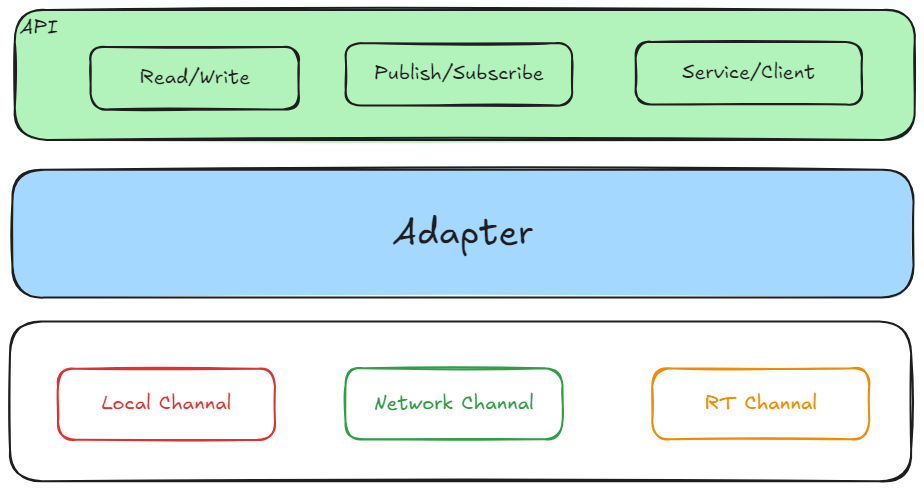

# Coin-Data
A high-performance data distribution library

## Main Framework


coin-data provide three common interface to users, `read/write`, `publish/subscribe`, `service/client`.

## Build
1. make `build` directory and change directory to `build`
    ```bash
    mkdir build && cd build
    ```
2. execute `cmake` command
    ```bash
    cmake -DCOIN_ENABLE_TEST=ON -DCMAKE_BUILD_TYPE=Release ..
    ```
3. run `make`
    ```bash
    make -j4
    ```
## Run test sample
1. change directory to `build`
    ```bash
    cd build
    ```
2. start write node
    ```bash
    COIN_NODE_NAME=publisher ./src/coin-data/test/coin-data-publisher
    ```
3. start read node
    ```bash
    COIN_NODE_NAME=subscriber ./src/coin-data/test/coin-data-subscriber
    ```
